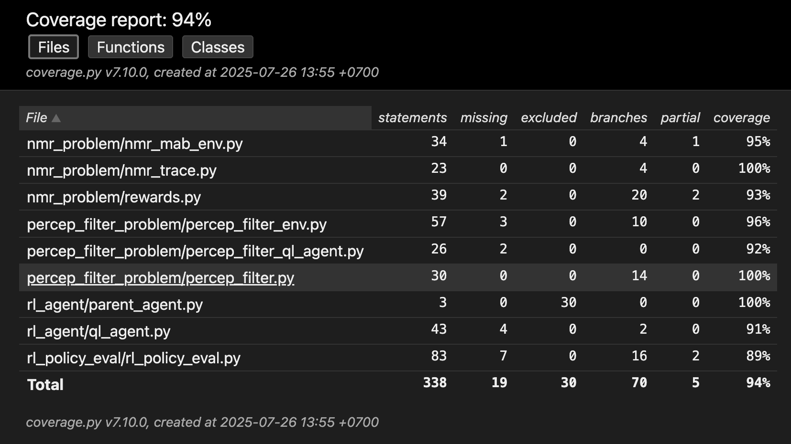

# Reinforcement Learning with Policy Evaluation in Non-Markovian Environments

This project implements and evaluates Q-learning (QL) agents in both Markovian and non-Markovian environments using Gymnasium. It has code for:
- Policy evaluation through repeated trials
- Multi-armed bandit (MAB) that has customizable reward structures and can implement trace-based non-Markovian reward behavior
- QL agent that filters its own perception
- Visual analysis of agent performance

## Project Structure
```bash
.
├── nmr_problem/              # MAB with custom Markov/non-Markov rewards
├── percep_filter_problem/    # Two-cup problem env. and QL agent that filters its own perception
├── rl_agent/                 # Q-learning agent and parent class
├── rl_policy_eval/           # Policy evaluation module (Braun 2021 method)
├── requirements.txt
├── setup.py
└── test.py                   # Misc. tests
```

## Key Features
### Policy Evaluation Framework
Implements a robust evaluation method:
1. Train QL agents for N steps.
2. Test their greedy policy across episodes.
3. Repeat this process over multiple trials.
4. Record the median reward at fixed intervals.
5. Visualize performance across time.

This approach is directly inspired by the method described in Braun (2021) *Getting to school on time: Completing linear temporal logic objectives before a fixed deadline with reinforcement learning.*

### Custom Environments
`nmr_problem/`
- MAB-style environment with customizable rewards.
- Allows switching between Markovian and non-Markovian modes.
- Uses a singly-linked list trace to track agent histories.

`percep_filter_problem/`
- A structured two-cup environment with discrete actions.
### Visualisation
- After evaluation, plots median average reward vs steps taken.
- Optional saving to .svg for integration into reports/papers.
### Testing
- Uses `pytest` for unit testing
#### Current code coverage:

- generated using `pytest` and `pytest-cov`
### Getting Started
Just clone project and install requirements.txt.
### Run Demos
Inside `nmr_problem` and `percep_filter_problem` are Jupyter Notebooks for running code.
## Requirements
- Python 3.11+
- numpy
- matplotlib
- gymnasium
- pytest
- pytest-cov
## Acknowledgments
- Braun (2021) for the policy evaluation method.
- Farama Gymnasium for the environment framework.

